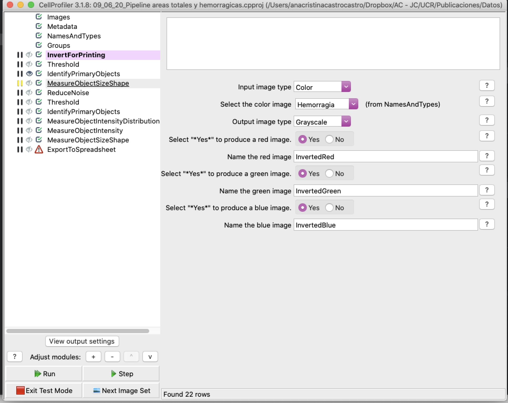
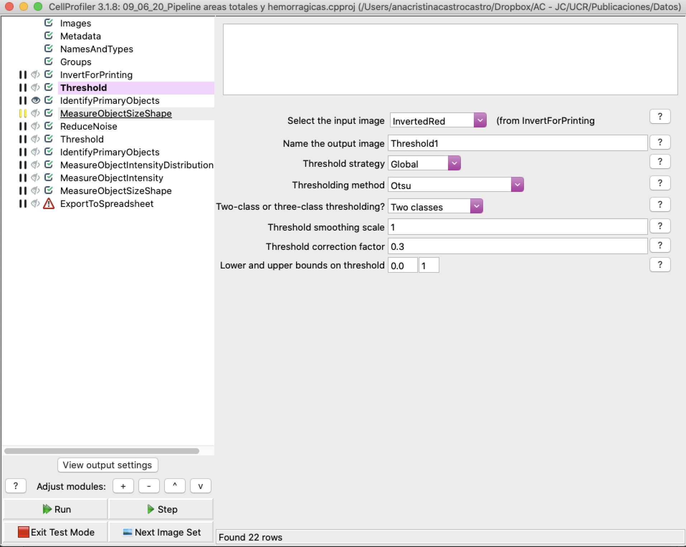
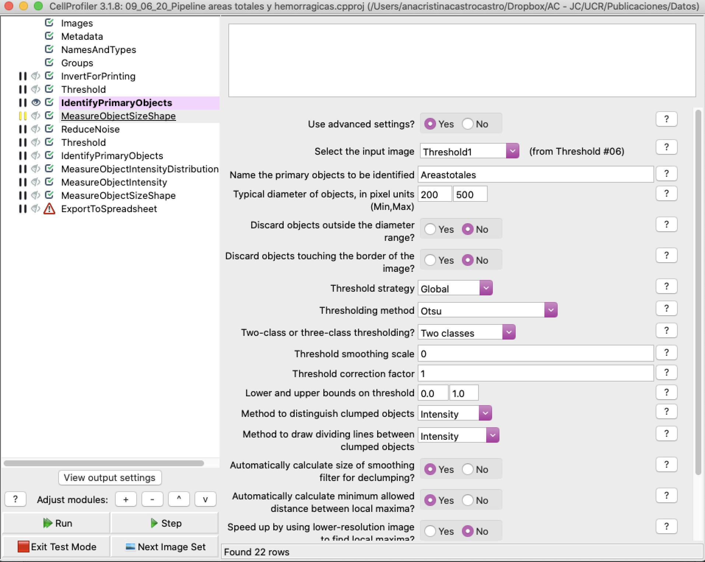
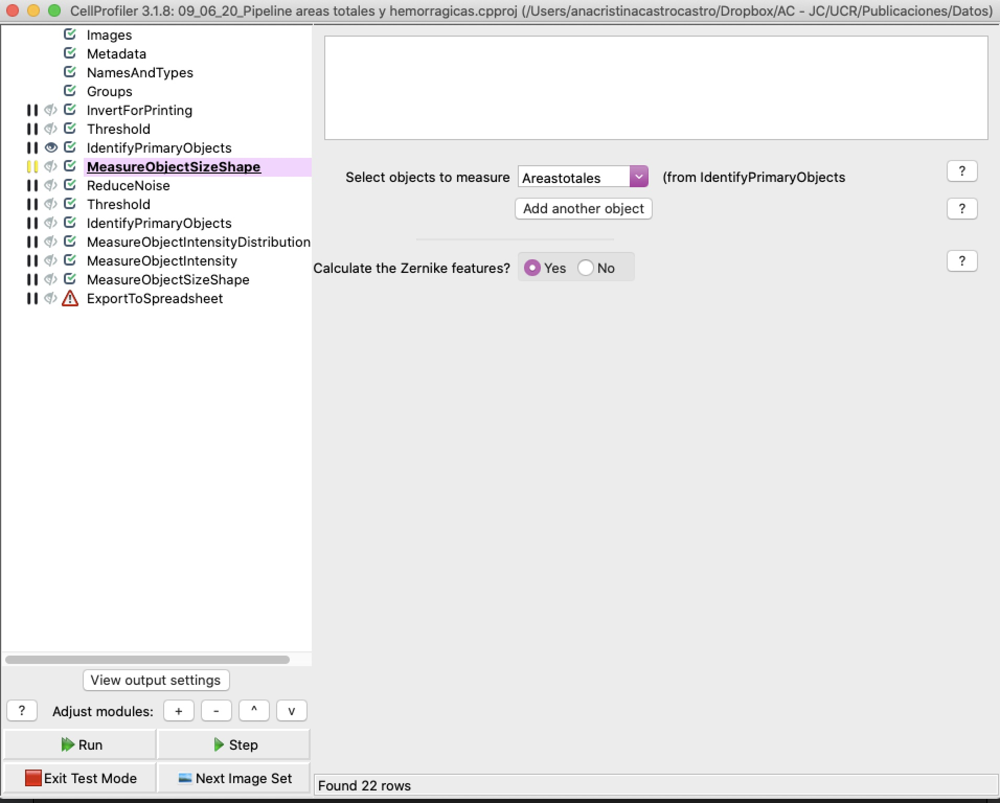
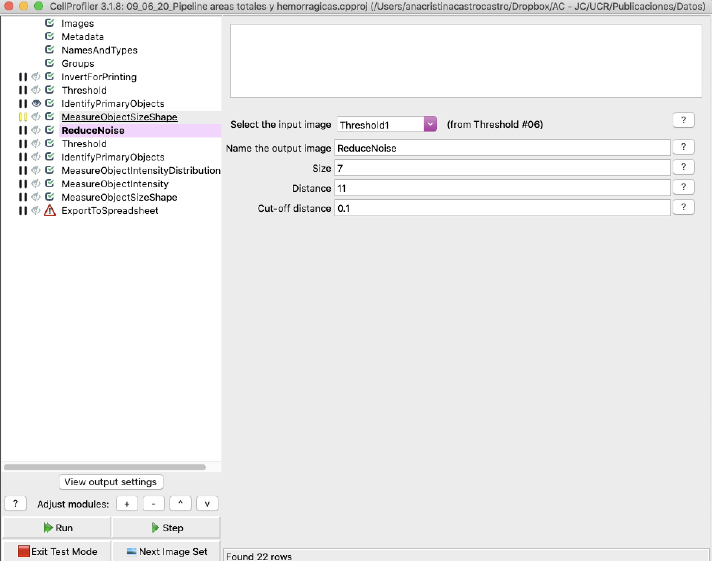
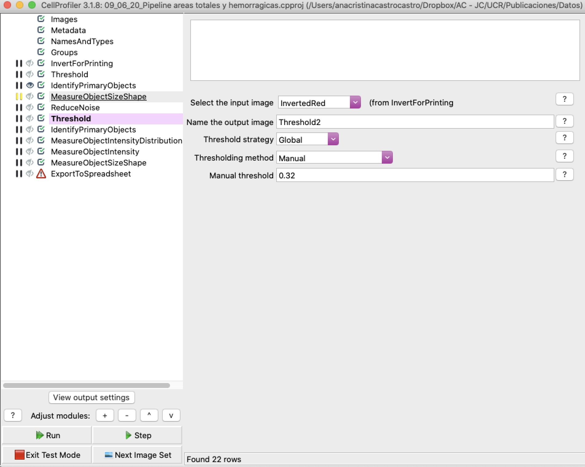
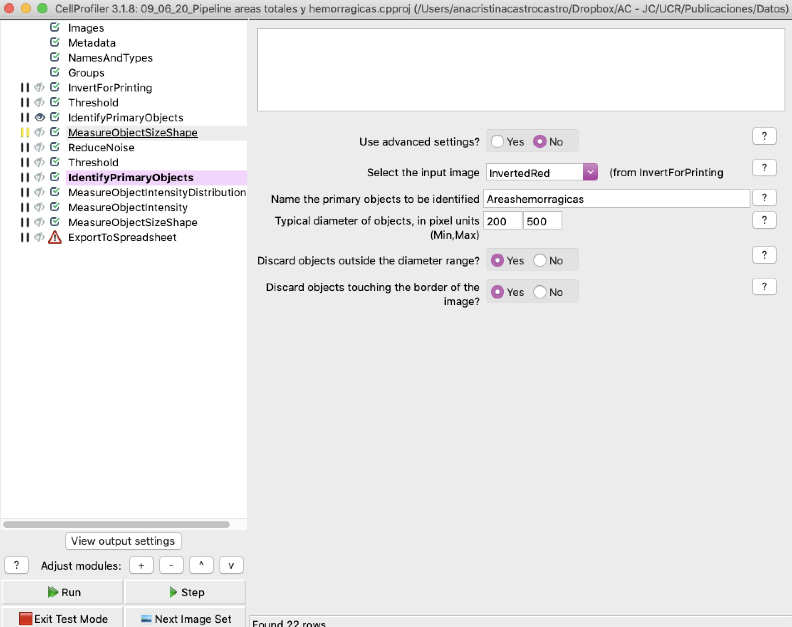
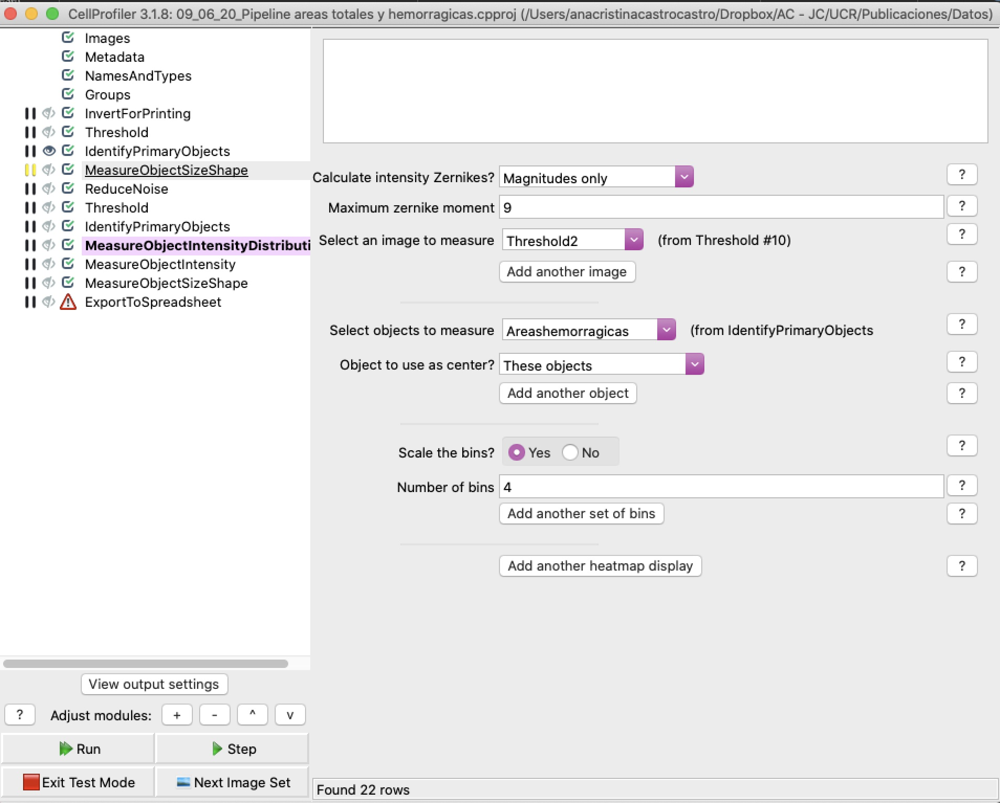
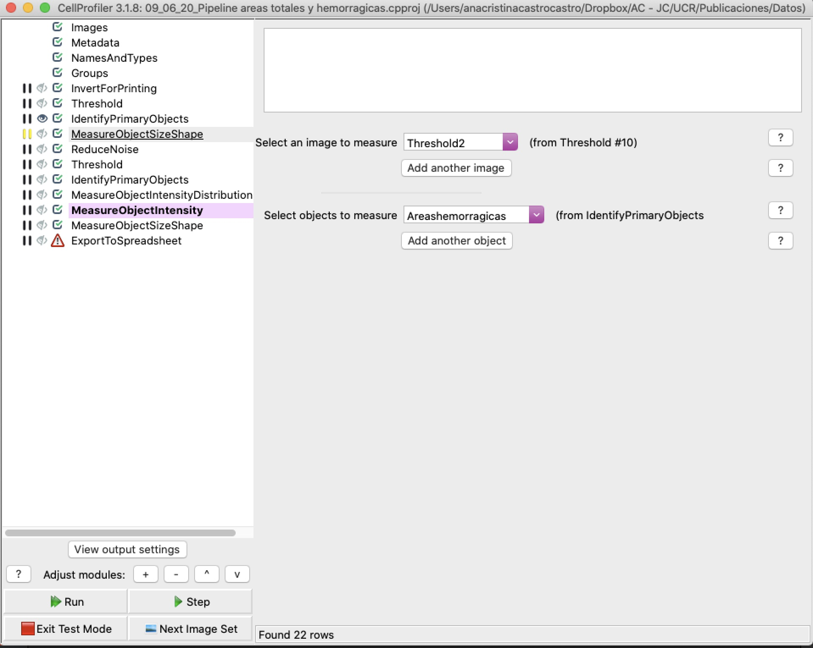
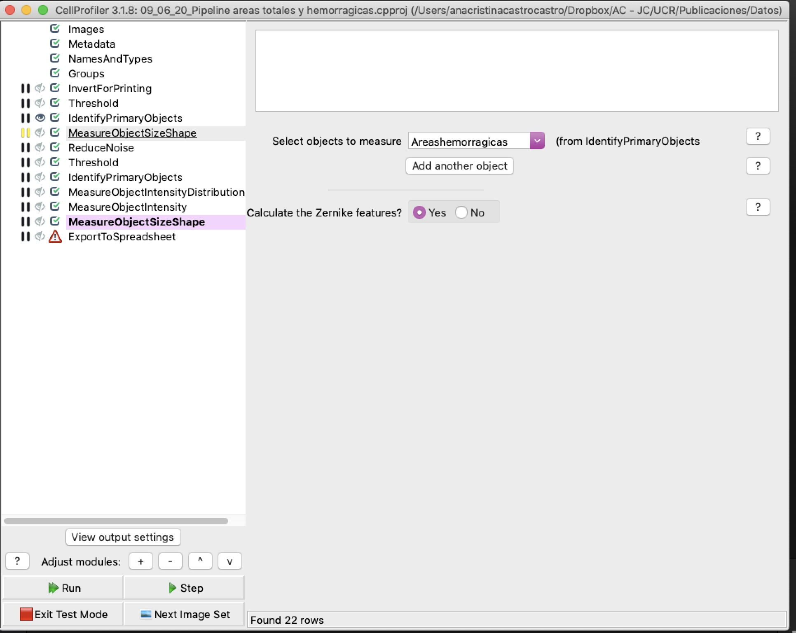

# Overview
This is the companion repository to the article "Basement membrane degradation and inflammation play a role in the pulmonary hemorrhage induced by a P-III snake venom metalloproteinase" (2021) - https://doi.org/10.1016/j.toxicon.2021.04.012.

This repository contains a quick guide to the digital image analysis pipeline used in the article to quantify lung hemorrhage.

## Example runs
The following two runs show the CellProfiler pipeline running on control images:

...and on treated samples:

## Configuration
In order to configure a similar pipeline, here's an overview of the flow:

## Configuration details
And, to follow the process in more detail, the following table specifies the individual steps in the pipeline:

| Module | Function |
| --- | --- |
LoadImages | Loads image data from files.
InvertForPrinting | Inverts image color channels to facilitate background removal.
ColortoGray | Converts image into grayscale, which enables image processing algorithms to run correctly.
Threshold | Highlights hemorrhagic areas in images. Adaptative mode, Otsu method, two-class, isolation scale 0.0, threshold correction value 1.3 and adaptative window size 500.
IdentifyPrimaryObjects | Identifies hemorrhagic areas through contrast differences. Minimum object diameter 10, maximum 1000; threshold correction 1.0; threshold: 0.0 - 1.0); based on intensity.
MeasureObjectSizeShape | Calculates the Zernicke properties of selected objects.
Threshold | Global manual thresholding with a value of 0.089.
IdentifyPrimaryObjects | Identifies main lung areas with diameters between 200 and 500.
MeasureObjectIntensityDistribution | Measure light intensity distribution for hemorrhagic areas.
MeasureObjectIntensity | Measure total lung area intensity.
MeasureObjectSizeShape | Measure hemorrhagic and total lung areas.
ExportToSpreadsheet | Save analysis results to a spreadsheet.

These values provide a useful baseline to detect and measure hemorrhagic areas in lung tissue. This pipeline could be adapted to measure other kinds processes in other tissues, as well.

### Thanks!
> Ana Cristina Castro, 2021.
